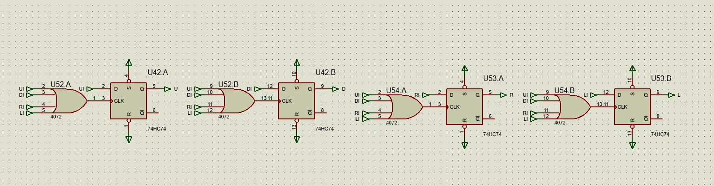
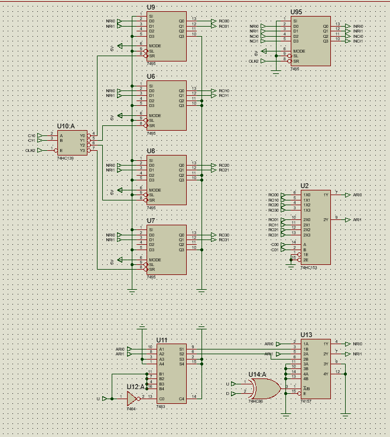
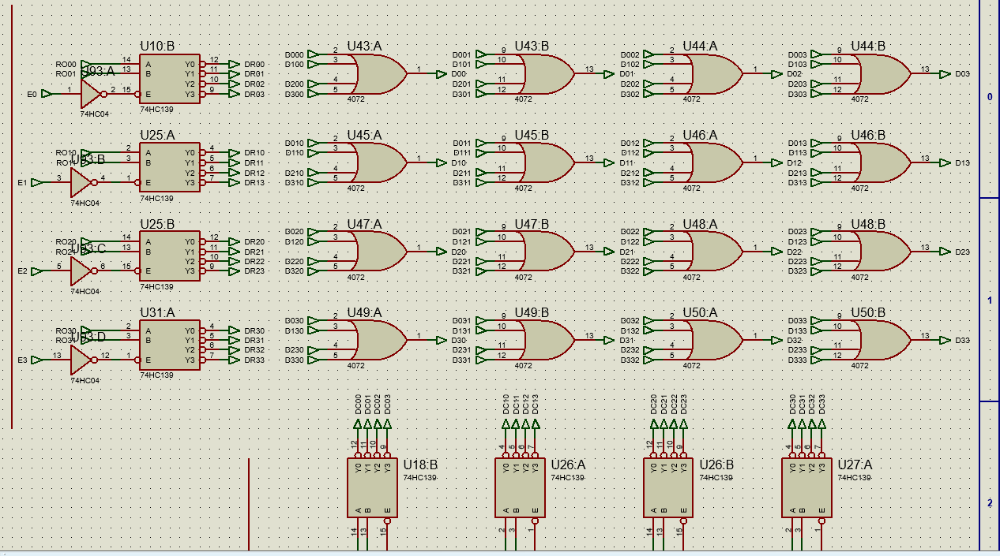

# Hardware Snake Game

Traditional implementations of the Snake game often use a microcontroller interfaced with a display. In contrast, this project aimed to recreate the game logic using fundamental non-programmable ICs. This not only highlights resourcefulness but also reinforces the basic principles of digital electronics, making it an intriguing study in minimalist hardware design.

The project followed a ground-up approach, developing every aspect from scratch while referencing the operations of integrated circuits. The process involved conceptualization, component selection, circuit design, simulation, and physical implementation on breadboards.

## Project Structure

The project is organized into four main sub-circuits, each responsible for a critical aspect of the Snake game:

1. **Input Direction**
2. **Movement Processing**
3. **Length Calculation**
4. **Output Display (4x4 LED Matrix)**

### 1. Input Direction

#### Fixed Logic Design in Simulation

- **Components**:
  - Toggle switches (Up, Down, Left, Right)
  - D-latches (7474)
  - 4-input OR Gate (4072)

- **Working**:
  - Toggle switches allow users to direct the snake.
  - D-latches store the state of each direction, interfacing with the movement calculation circuit to determine the snake's next position.
  - Successful simulation in Proteus captured user inputs accurately.

#### Hardware Implementation (with Arduino)

- **Components**:
  - Arduino Uno
  - Joystick Module
  - De-multiplexer (SN74LS139)

- **Working**:
  - Joystick updates a direction variable.
  - The variable is converted to binary and processed by a de-multiplexer to control the snake's direction.

### 2. Movement Processing

#### Fixed Logic Design in Simulation

- **Components**:
  - 4-bit Universal Shift Registers (SN74LS95)
  - Multiplexers (74LS153, 74LS157)
  - Adders (74LS83)
  - Counters (4520)
  - De-Multiplexer (74LS139)

- **Working**:
  - Coordinates of the snake are stored in shift registers.
  - Movement is processed using counters and multiplexers to update the snake's position.

#### Hardware Implementation

- **Components**:
  - Shift Registers
  - Arduino Uno

- **Working**:
  - Clock and counters are provided by Arduino to avoid synchronization issues

### 3. Length Calculation

#### Fixed Logic Design in Simulation

- **Components**:
  - D-Latches (7474)
  - De-Multiplexers (74LS139)
  - Counters (4520)
  - Comparators (7485)
  - AND, OR, NOT Gates

- **Working**:
  - Length control uses D-latches and counters.
  - Snake length increases upon detecting a fruit using a comparator.

### 4. Output Display (4x4 LED Matrix)

#### Fixed Logic Design in Simulation

- **Components**:
  - De-Multiplexers (SN74LS139)
  - NOR Gates (4007)
  - OR Gates (4027)

- **Working**:
  - Converts snake coordinates into a 4x4 display matrix for real-time visualization.
  - Combination of NOR gates forms a matrix indicating snake's position.

#### Hardware Implementation (with Arduino)

- **Components**:
  - Shift Registers (74LS95)
  - Arduino Uno
  - 4x4 LED Matrix

- **Working**:
  - Coordinates processed and displayed using a 4x4 LED matrix controlled by Arduino.
  - The Arduino handles data transfer and display updates.

